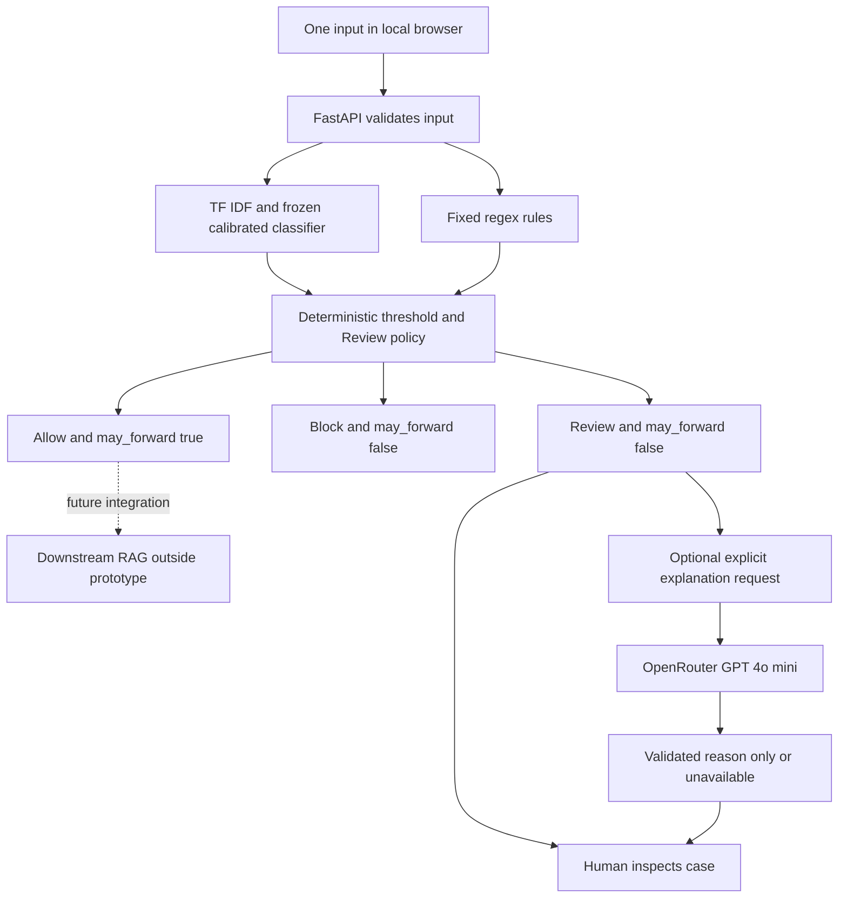

# PromptGate product documentation

Project owner: SIwen Liu. Course: PE6201 Emerging AI Technologies.

## Persona and use

Mei is an enterprise AI engineer preparing a RAG assistant for release. She understands model metrics but cannot inspect every input. This prototype lets her inspect a prompt, a frozen policy decision and its reason. Only Allow is marked eligible for forwarding. Review and Block are held. A production RAG integration and persistent human approval workflow are not implemented.

## Input and output

- Input: one non-empty standalone string, at most 8,000 characters, intended for English text. Language is not automatically validated. No attachments or conversation history are processed.
- Output: `action` (`Allow`, `Block`, `Review`), `risk_score`, `reason`, model and policy versions, latency, `llm_calls`, `may_forward`, and `review_required`.
- `may_forward` is true only for an `ok` Allow result. It is a signal for an integrating application, not execution or an authenticated permission grant.
- Optional Review explanation: a separate response with a short explanation, status, cost/token metadata when available, and an unchanged Review action.

## High level architecture

Text equivalent: input validation → local classifier and fixed rules → frozen routing → Allow / Block / Review. Only a separate user-requested Review explanation invokes the external LLM. No LLM output has a path back to routing or forwarding. No retrieval, tool execution or autonomous agent loop is present.

## Exact frozen policy

The selected Naive Bayes model has binary threshold `t = 0.11926076584140256` and Review margin `m = 0.105`.

1. If calibrated score is at least `t + m` (approximately 0.224261), return Block.
2. Otherwise, if score is at least `max(0, t - m)` (approximately 0.014261), or any regex matches, return Review.
3. Otherwise, return Allow.

A rule match alone does not force Block. The model name and policy are frozen on development data; the UI also exposes the separately frozen logistic candidate for comparison. Binary classifier-only benchmarks use threshold `t` without Review and are not the web-app policy. Scores are calibrated on the source domain, not certified external probabilities.

## Targets and measured outcomes

| Measure | Target or constraint | Measured outcome | Interpretation |
| --- | --- | --- | --- |
| External attack block recall | At least 80% | Hybrid 201/263 = 76.4% | Not met |
| External benign block FPR | At most 5%; threshold selected on development only | Hybrid 147/399 = 36.8% | Not met; actual FPR, never capped |
| Review workload | Margin tuned under 19% development cap | External 185/662 = 27.9% | Did not generalise |
| Review error capture | Measure against paired binary decisions | 53/225 = 23.6% | Captured for review, not proven corrected |
| Total benign hold burden | Diagnostic, no separate numeric target | 295/399 = 73.9% | Includes false blocks and benign Reviews |
| LLM call rate in final console | Proposal aspiration below 20% | `/screen` makes zero calls; explanation is optional | No measured user-driven explanation rate; explaining every external Review would mean 27.9% |
| Initial one-call MVP | 100 real prompts; recall greater than 58.3%, FPR at most 5% | 100 completed; recall 50%, FPR 0% | Technical run completed; numeric acceptance failed |
| Cost and latency | Measure, not a production SLA | LLM baseline US$0.0066129 total; p95 3.42 s | Not the explanation endpoint's measured cost or latency |

Full definitions and other metrics: [evaluation explanation](../evals/README.md). Numbers are frozen run evidence, not prospective guarantees.

## Owned and rented components

| Layer | Choice | Reason |
| --- | --- | --- |
| Interface and serving | Own HTML console and FastAPI integration | Show decision boundaries and prohibit accidental forwarding |
| Orchestration and policy | Own Python control flow | Deterministic routing and explicit external-call boundary |
| Narrow model | Fit with scikit-learn | Labelled bounded classification; low local inference cost |
| Foundation model | Rent `openai/gpt-4o-mini` through OpenRouter | Baseline and optional explanation only |
| Data | Reuse S-Labs; evaluate locally on deepset | Public benchmarks with documented portability limits |
| Retrieval | None | A downstream RAG assistant is outside the project |
| Evaluation and observability | Own metric code and text-free evidence records | Recompute outcomes without logging prompts or credentials |

## Limitations and course connection

This is a local research console, not a production security product. Class 1 appears in rules versus narrow ML; Class 2 in build/buy and evaluation; Class 3 in structured outputs; Class 5 in measured cost and latency; Class 6 in failure handling and guardrails. A Class 4 autonomous agent is deliberately excluded: screening does not require autonomous multi-step actions. OWASP provides risk framing, not a compliance claim.

Intended use is authorised experimentation with public or synthetic prompts. Do not upload confidential text, deploy the unauthenticated server publicly, load untrusted joblib files, or treat Allow as proof that a downstream system is safe. A checksum detects modification relative to metadata; it is not a trusted digital signature.
